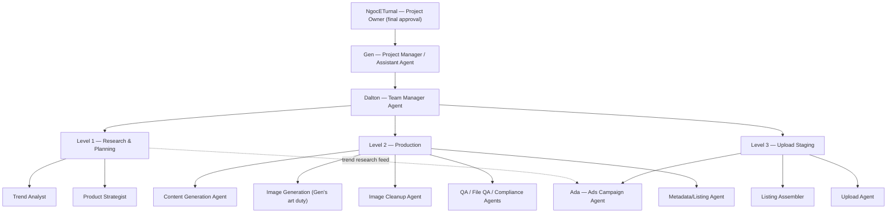

# 01 — Team Structure, Roles & Workflow (Part 1)

Defines the management chain, the three operational levels, the role agents, and the gated
handoff pipeline. Source of truth: the **KDP Project Complete Manual** (Section 0) plus the
Master Asset Compilation, with the owner's requested **Level 1 ↔ Level 2 swap applied**.

## Management chain

| Role | Who | Responsibility |
|------|-----|----------------|
| **Project Owner** | **NgocETurnal** | Final approval authority for all deployments and major decisions. Nothing ships to Amazon KDP without their sign-off. |
| **Project Manager / Assistant Agent** | **Gen** | Manages the entire KDP project end-to-end, understands the full codebase, **can set up the project and deploy code once approved**, and always seeks final approval from the Project Owner before deployment or major changes. Escalates blockers to NgocETurnal. |
| **Team Manager Agent** | **Dalton** | Manages the three operational levels day-to-day, maintains team harmony and forward momentum, assists teams directly when they're stuck. Escalates unresolved issues to Gen. |

```
NgocETurnal (Project Owner)
        ▲  final approval, escalations
      Gen (Project Manager / Assistant)
        ▲  managerial support, escalations Dalton can't resolve
    Dalton (Team Manager)
        ▲  day-to-day operations, harmony, unblocking
  Level 1  |  Level 2  |  Level 3   (production teams)
```

## The three operational levels

> Level numbering below reflects the owner's requested swap (research first, production
> second), so the levels read in pipeline order: **1 → 2 → 3**.

| Level | Function |
|-------|----------|
| **Level 1 — Research & Planning** | Researches trends and maps out products to be queued into the pipeline. The discovery/planning stage that feeds Level 2. |
| **Level 2 — Production** | Produces finished coloring pages ready to be uploaded to Amazon KDP. The final content-production stage. |
| **Level 3 — Upload Staging** | Stages finished products for upload and approval, and organizes them into Google Docs for tracking and review. |



## Role agents mapped to levels

| Role | Level | Responsibility |
|------|-------|----------------|
| Trend Analyst | 1 | Finds niches, keywords, demand signals for new book ideas |
| Product Strategist | 1 | Decides which concept to pursue; sets priority **dynamically by sales data** (currently kids > adult gift/sarcastic > wellness — see [print-guidelines](print-guidelines.md)) |
| Content Generation Agent | 2 | Drafts book concepts, titles, descriptions |
| Image Generation (executed by **Gen**) | 2 | Produces raw interior art per spec |
| Image Editing/Cleanup Agent | 2 | Fixes line weight, artifacts, upscaling |
| QA Agent | 2 | Validates files against KDP requirements before upload prep |
| Metadata/Listing Agent | 2 | Drafts title, subtitle, keywords, categories |
| Compliance Agent | 2 | Checks metadata against KDP policy |
| File QA Agent | 2 | Validates cover/interior file consistency |
| Listing Assembler | 3 | Compiles final KDP listing packet |
| Upload Agent | 3 | Saves draft or publishes **after human approval** |
| **Ads Campaign Agent ("Ada")** | 3 | Plans/optimizes Amazon Ads post-launch; consumes Level 1 trend research to stay current; never spends without owner approval — see [`../ads/AGENT.md`](../ads/AGENT.md) |

## Gen can set up the project

Gen's Project Manager role explicitly includes **bootstrapping the KDP project from
nothing**:

- Run `scripts/setup.sh` (venv + dependencies).
- Create the working folder structure for a book (`raw/`, `non_bleed/`, `bleed/`, `interiors/`).
- Initialize the tracking sheet from `templates/` (META_DRAFT / META_APPROVED / LISTS).
- Confirm the environment before the first generation, and deploy code **once the Project
  Owner approves**.

## Handoff workflow (gated pipeline)

```
Research → Metadata Draft → Compliance Review → File/Image QA → Listing Assembly
        → Human Approval → Upload → Post-launch Tracking
```

Every stage passes a **handoff packet** (JSON) forward — see
[`../schemas/handoff_packet.schema.json`](../schemas/handoff_packet.schema.json).

**Packet rules:** always pass the full packet forward; increment `packet_version` on any
change; `event_log` is append-only; verify `sha256` on receipt. `handoff_type`: `NORMAL`,
`RETRY` (resubmission after a fix), `ESCALATION` (escalated up the chain to Gen / the owner).

## Escalation flow

1. Level 1/2/3 production issues are raised to **Dalton**.
2. If Dalton cannot resolve it, Dalton escalates to **Gen**.
3. Gen reviews; decisions beyond Gen's authority go to **NgocETurnal** for final approval.
4. Once approved, Gen may deploy — production changes still require the explicit
   confirmation gate.

> The supporting infrastructure for this chain (KDP Agent CLI, SQLite message bus, web
> dashboard, semantic search) is described in
> [`06-infrastructure-roadmap.md`](06-infrastructure-roadmap.md).
