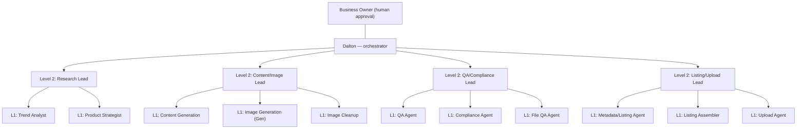

# 01 — AI Team Roles & Workflow (Part 1)

Defines the agent team, reporting lines, team levels, and the gated handoff pipeline.

## Reporting structure

All team leaders report to **Dalton** (single point of contact). Team leaders manage their
own workers. Only team leaders communicate with Dalton. **No upload/publish action happens
without explicit human approval.**

### Team levels

> **Level assignment (per request — please confirm):** **Level 1 = workers/specialists**,
> **Level 2 = team leaders** (the senior tier that reports to Dalton). This reflects your
> instruction to swap the two level names. If you meant the reverse (Level 1 = leaders),
> say so and it's a one-line change here.

- **Owner / Business Owner** — final human approval; escalation target.
- **Dalton** — orchestrator; single point of contact for all team leaders.
- **Level 2 — Team Leaders** — one per functional team; report to Dalton, manage their Level 1 workers.
- **Level 1 — Workers / Specialists** — the role agents below; execute tasks, report to their Level 2 leader.



## Roles

| Role | Level | Responsibility |
|------|-------|----------------|
| Trend Analyst | 1 | Finds niches, keywords, demand signals for new book ideas |
| Product Strategist | 1 | Decides which concept to pursue; sets priority (adult sarcastic/gift > kids > wellness) |
| Content Generation Agent | 1 | Drafts book concepts, titles, descriptions |
| **Image Generation Agent ("Gen")** | 1 | Produces raw interior art per spec — **and can bootstrap/set up the KDP project** (see below) |
| Image Editing/Cleanup Agent | 1 | Fixes line weight, artifacts, upscaling |
| QA Agent | 1 | Validates files against KDP requirements before upload prep |
| Metadata/Listing Agent | 1 | Drafts title, subtitle, keywords, categories |
| Compliance Agent | 1 | Checks metadata against KDP policy |
| File QA Agent | 1 | Validates cover/interior file consistency |
| Listing Assembler | 1 | Compiles final KDP listing packet |
| Upload Agent | 1 | Saves draft or publishes **after human approval** |

## Gen can set up the project

In addition to generating art, **Gen is authorized to bootstrap the KDP project** so a run
can start from nothing:

- Run `scripts/setup.sh` (create the venv, install dependencies).
- Create the working folder structure for a book (`raw/`, `non_bleed/`, `bleed/`, `interiors/`).
- Initialize the tracking sheet from `templates/` (META_DRAFT / META_APPROVED / LISTS headers).
- Confirm the environment (Python, Pillow) before the first generation.

This is documented so setup is never a blocker — if the handbook didn't state it, it does now.

## Handoff workflow (gated pipeline)

```
Research → Metadata Draft → Compliance Review → File/Image QA → Listing Assembly
        → Human Approval → Upload → Post-launch Tracking
```

Every stage passes a **handoff packet** (JSON) forward — see
[`../schemas/handoff_packet.schema.json`](../schemas/handoff_packet.schema.json) and
[`02-metadata-tracking-system.md`](02-metadata-tracking-system.md).

**Packet rules:** always pass the full packet forward; increment `packet_version` on any
change; `event_log` is append-only; verify `sha256` on receipt. `handoff_type`: `NORMAL`,
`RETRY` (resubmission after a fix), `ESCALATION` (Dalton has involved the business owner).
